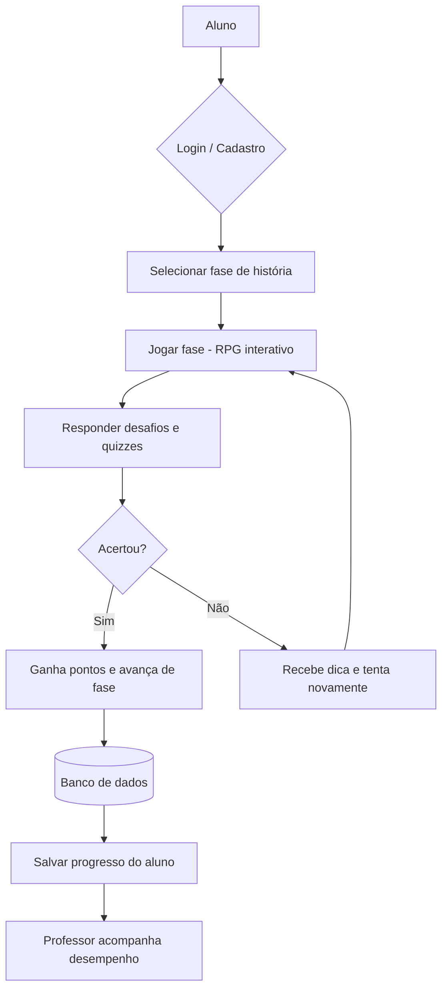
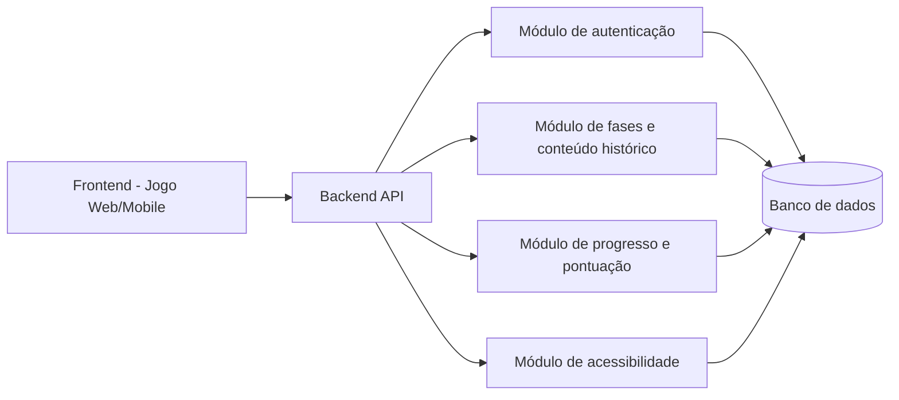
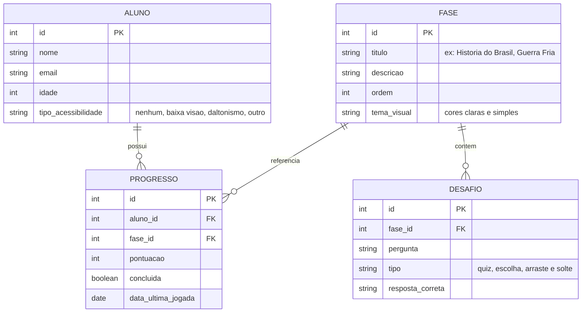

# Arquitetura da Solução — RPG Educativo de História

## 1. Fluxo do sistema

## 2. Arquitetura em camadas

## 3. Modelo de dados (entidades principais)

## 4. Justificativa das escolhas

- **Frontend web/mobile**: garante que o jogo funcione tanto em computadores da escola quanto em celulares e tablets em casa.
- **Módulo de autenticação**: permite identificar o aluno e salvar seu progresso individual, além de diferenciar o acesso do professor.
- **Módulo de fases e conteúdo histórico**: organiza o jogo em fases temáticas (História do Brasil, Guerra Fria, etc.), permitindo expandir o conteúdo facilmente com novos temas no futuro.
- **Módulo de progresso e pontuação**: registra o desempenho de cada aluno, permitindo que o professor acompanhe a evolução da turma e identifique dificuldades específicas.
- **Módulo de acessibilidade**: cobre o requisito de cores claras, simples e de fácil entendimento, adaptando o jogo para alunos com deficiência visual ou outras necessidades.
- **Desafios em formato de quiz e interações lúdicas**: tornam o aprendizado mais intuitivo e engajador, reforçando o conteúdo através da prática e repetição espaçada.
- **Link para o Trello:** https://trello.com/invite/b/6a904838e8e74e40bcb39308/ATTIe9681c31babd2c278316ce89ad6a2d9dFDE12283/jogo-rpg
