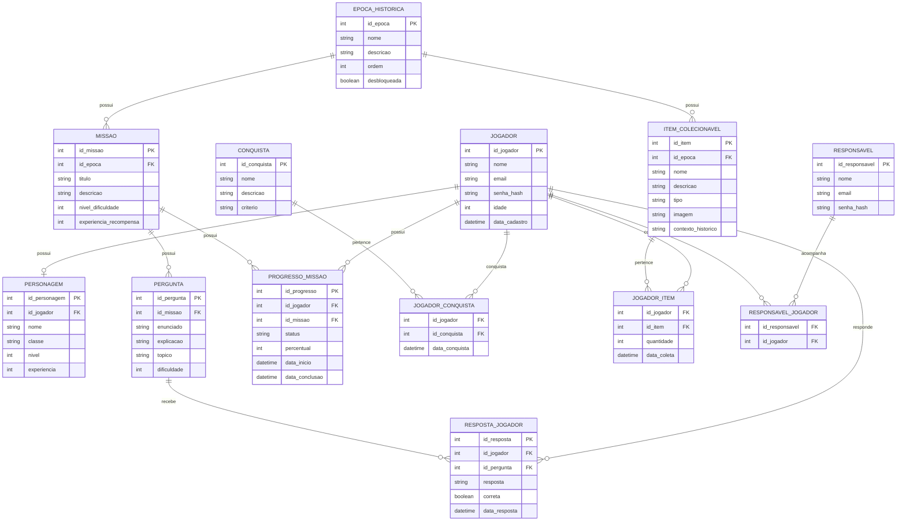

# Arquitetura do Sistema — AprendeRPG

## 1. Visão Geral

O **AprendeRPG** é um jogo educacional em formato RPG desenvolvido para auxiliar crianças com dificuldades no aprendizado da disciplina de História.

O sistema utiliza elementos tradicionais de jogos, como exploração, missões, personagens, batalhas, recompensas e desbloqueio de áreas, integrando o conteúdo histórico às próprias mecânicas do jogo.

O objetivo é transformar o estudo de História em uma experiência interativa e lúdica, utilizando desafios históricos como parte da progressão do jogador.

---

## 2. Objetivo do Sistema

O sistema tem como objetivos:

* Ensinar conteúdos históricos de maneira lúdica;
* Estimular a participação ativa do aluno;
* Utilizar perguntas históricas como parte das mecânicas do RPG;
* Adaptar a dificuldade conforme o desempenho do jogador;
* Fornecer feedback educativo após erros;
* Registrar o progresso do jogador;
* Permitir acompanhamento do desempenho por responsáveis ou professores;
* Utilizar recompensas e itens colecionáveis para estimular a exploração.

---

## 3. Arquitetura Geral

O sistema será organizado em três camadas principais:

```text
┌─────────────────────────────────────────────┐
│              CLIENTE / FRONTEND             │
│                                             │
│  • Interface do jogo                        │
│  • Personagem                               │
│  • Mapa                                     │
│  • Linha do tempo                           │
│  • Missões                                  │
│  • NPCs                                     │
│  • Quiz / desafios                          │
│  • Inventário                               │
│  • Acessibilidade                           │
└──────────────────────┬──────────────────────┘
                       │
                       ▼
┌─────────────────────────────────────────────┐
│                  BACKEND                    │
│                                             │
│  • Autenticação                             │
│  • Usuários                                 │
│  • Missões                                  │
│  • Perguntas                                │
│  • Avaliação                                │
│  • Dificuldade adaptativa                   │
│  • Progresso                                │
│  • Conquistas                               │
│  • Relatórios                               │
│  • Sincronização                            │
└──────────────────────┬──────────────────────┘
                       │
                       ▼
┌─────────────────────────────────────────────┐
│                    DADOS                    │
│                                             │
│  • Banco de dados relacional                │
│  • Armazenamento de mídias                  │
│  • Dados de progresso                       │
│  • Conteúdo histórico                       │
└─────────────────────────────────────────────┘
```

---

## 4. Componentes do Sistema

### 4.1 Frontend / Motor do Jogo

Responsável pela interação direta com o jogador.

Principais componentes:

* Tela inicial;
* Cadastro e login;
* Criação do personagem;
* Mapa;
* Linha do tempo;
* Missões;
* Diálogos com NPCs;
* Sistema de combate;
* Perguntas históricas;
* Sistema de recompensas;
* Diário;
* Inventário;
* Tela de progresso;
* Recursos de acessibilidade.

---

### 4.2 Backend

O backend será responsável pela lógica de negócio e comunicação entre o jogo e o banco de dados.

Principais responsabilidades:

* Autenticação;
* Gerenciamento de jogadores;
* Gerenciamento de personagens;
* Gerenciamento de épocas históricas;
* Gerenciamento de missões;
* Gerenciamento de perguntas;
* Registro das respostas;
* Avaliação do desempenho;
* Controle de dificuldade;
* Controle de progresso;
* Controle de conquistas;
* Gerenciamento de itens;
* Geração de relatórios;
* Sincronização dos dados offline.

---

### 4.3 Banco de Dados

O banco será relacional e armazenará as principais informações do sistema.

Entidades principais:

* JOGADOR
* RESPONSAVEL
* PERSONAGEM
* EPOCA_HISTORICA
* MISSAO
* PERGUNTA
* RESPOSTA_JOGADOR
* PROGRESSO_MISSAO
* CONQUISTA
* JOGADOR_CONQUISTA
* ITEM_COLECIONAVEL
* JOGADOR_ITEM
* RESPONSAVEL_JOGADOR

---

# 5. Fluxo Principal do Sistema

```mermaid
flowchart TD

    A([Início]) --> B{Possui cadastro?}

    B -- Não --> C[Realizar cadastro]
    C --> D{Cadastro válido?}
    D -- Não --> C
    D -- Sim --> E[Realizar login]

    B -- Sim --> E

    E --> F{Credenciais válidas?}
    F -- Não --> G[Exibir erro]
    G --> E
    F -- Sim --> H[Carregar perfil]

    H --> I[Carregar progresso]
    I --> J{Missão disponível?}

    J -- Não --> K[Explorar linha do tempo]
    K --> L{Nova época desbloqueada?}
    L -- Não --> K
    L -- Sim --> M[Exibir missões]

    J -- Sim --> M

    M --> N[Selecionar missão]
    N --> O{Requisitos atendidos?}

    O -- Não --> P[Exibir requisitos]
    P --> M

    O -- Sim --> Q[Iniciar missão]
    Q --> R[Explorar / conversar com NPC]

    R --> S[Apresentar desafio histórico]
    S --> T[Responder pergunta]

    T --> U{Resposta correta?}

    U -- Sim --> V[Executar ação do RPG]
    V --> W[Conceder recompensa]
    W --> X{Missão concluída?}

    U -- Não --> Y[Exibir explicação educativa]
    Y --> Z{Nova tentativa?}

    Z -- Sim --> T
    Z -- Não --> AA[Registrar dificuldade]
    AA --> X

    X -- Não --> R
    X -- Sim --> AB[Registrar conclusão]

    AB --> AC[Atualizar progresso]
    AC --> AD[Registrar conquista]
    AD --> AE[Atualizar inventário]

    AE --> AF{Internet disponível?}

    AF -- Sim --> AG[Sincronizar dados]
    AF -- Não --> AH[Salvar dados localmente]

    AH --> AI[Aguardar conexão]
    AI --> AG

    AG --> AJ[Atualizar relatório]

    AJ --> AK([Fim])
```



---

# 6. Regras de Negócio

### RN01 — Cadastro

O jogador deve possuir um cadastro válido para acessar o sistema.

### RN02 — Autenticação

O acesso ao perfil do jogador depende da validação das credenciais.

### RN03 — Épocas históricas

As épocas históricas podem possuir diferentes estados de desbloqueio.

### RN04 — Missões

Uma missão somente poderá ser iniciada quando seus requisitos forem atendidos.

### RN05 — Desafios

Os desafios históricos fazem parte da mecânica de progressão do RPG.

### RN06 — Resposta correta

Uma resposta correta permite a execução da ação relacionada ao desafio.

### RN07 — Resposta incorreta

Quando o jogador errar, o sistema deverá apresentar uma explicação educativa.

### RN08 — Reforço

Erros recorrentes devem ser registrados para auxiliar na identificação dos conteúdos que precisam de reforço.

### RN09 — Recompensas

Missões concluídas podem gerar experiência, conquistas e itens colecionáveis.

### RN10 — Inventário

Itens coletados devem ser registrados no inventário do jogador.

### RN11 — Progresso

O sistema deve registrar o progresso individual de cada jogador.

### RN12 — Desempenho

As respostas devem ser utilizadas para calcular o desempenho por tópico histórico.

### RN13 — Dificuldade adaptativa

O sistema poderá ajustar a dificuldade dos desafios de acordo com o desempenho do jogador.

### RN14 — Funcionamento offline

O jogador deverá conseguir utilizar funcionalidades previamente disponibilizadas mesmo sem conexão com a internet.

### RN15 — Sincronização

Os dados armazenados localmente deverão ser sincronizados com o servidor quando a conexão estiver disponível.

---

# 7. Modelo Entidade-Relacionamento



---

# 8. Requisitos Relacionados à Arquitetura

| Requisito                      | Componente responsável                   |
| ------------------------------ | ---------------------------------------- |
| RF01 — Combate/magia           | Frontend + Backend                       |
| RF02 — Linha do tempo          | Frontend + Backend                       |
| RF03 — NPCs históricos         | Frontend + Banco de Dados                |
| RF04 — Diário/Inventário       | Frontend + Banco de Dados                |
| RF05 — Dificuldade adaptativa  | Backend                                  |
| RF06 — Feedback educativo      | Frontend + Backend                       |
| RF07 — Relatório de desempenho | Backend + Frontend                       |
| RNF01 — Acessibilidade         | Frontend                                 |
| RNF02 — Linguagem simples      | Frontend + Conteúdo                      |
| RNF03 — Estética 2D/pixel art  | Frontend                                 |
| RNF04 — Carregamento           | Frontend + Backend                       |
| RNF05 — Offline                | Frontend + Armazenamento local + Backend |
| RNF06 — Privacidade            | Backend + Banco de Dados                 |

---

# 9. Funcionamento Offline

O sistema deverá utilizar armazenamento local para preservar informações essenciais durante períodos sem conexão.

Fluxo simplificado:

```text
Jogador
   ↓
Frontend
   ↓
Existe conexão?
   ├── SIM → API → Banco de Dados
   │
   └── NÃO → Armazenamento Local
                  ↓
            Progresso temporário
                  ↓
          Conexão restabelecida
                  ↓
             Sincronização
                  ↓
              API / Banco
```

A implementação definitiva do mecanismo de armazenamento local e sincronização deverá ser definida durante a etapa de desenvolvimento.

---

# 10. Segurança e Privacidade

Por se tratar de um sistema destinado ao público infantil, os dados dos jogadores devem ser tratados de acordo com os requisitos de privacidade e proteção de dados aplicáveis.

O sistema deverá:

* Evitar armazenamento desnecessário de dados pessoais;
* Proteger credenciais;
* Utilizar senhas armazenadas de forma segura;
* Controlar o acesso às informações do jogador;
* Restringir o acesso de responsáveis aos dados permitidos;
* Proteger os dados durante a comunicação entre cliente e servidor.

---

# 11. Evolução da Arquitetura

A arquitetura poderá ser expandida conforme o desenvolvimento do projeto.

Possíveis futuras funcionalidades:

* Novas épocas históricas;
* Novos personagens;
* Sistema de níveis;
* Mais tipos de combate;
* Ranking;
* Multiplayer;
* Sistema de recomendação de conteúdos;
* Painel completo para professores;
* Mais recursos de acessibilidade;
* Aplicativo para dispositivos móveis.

---

# 12. Status

**Estado atual:** Planejamento e levantamento de requisitos.

### Concluído

* Levantamento dos requisitos;
* Definição inicial da arquitetura;
* Fluxo principal;
* Regras de negócio;
* Modelo inicial de dados;
* Identificação das necessidades de acessibilidade;
* Identificação da necessidade de funcionamento offline.

### Pendente

* Implementação do `ITEM_COLECIONAVEL`;
* Definição definitiva do armazenamento local;
* Definição do mecanismo de sincronização;
* Detalhamento da acessibilidade;
* Definição da tecnologia do frontend/motor do jogo;
* Definição da tecnologia do banco de dados;
* Implementação da API;
* Desenvolvimento do MVP;
* Testes com usuários.

---

# 13. Próximos Passos

1. Finalizar o modelo de banco de dados.
2. Definir as tecnologias do frontend, backend e banco.
3. Definir a estrutura inicial do repositório.
4. Criar o MVP.
5. Implementar cadastro e autenticação.
6. Implementar uma primeira época histórica.
7. Implementar uma primeira missão.
8. Implementar perguntas e respostas.
9. Implementar o sistema de progresso.
10. Implementar recompensas.
11. Implementar o inventário.
12. Implementar armazenamento offline.
13. Implementar sincronização.
14. Realizar testes.
15. Avaliar o desempenho pedagógico.

