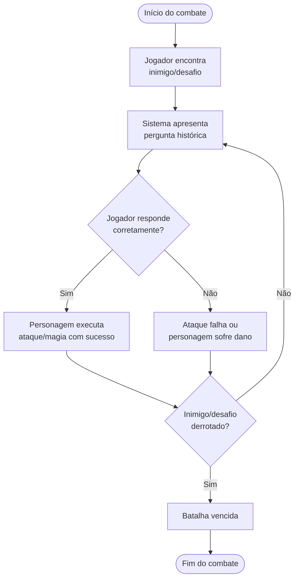
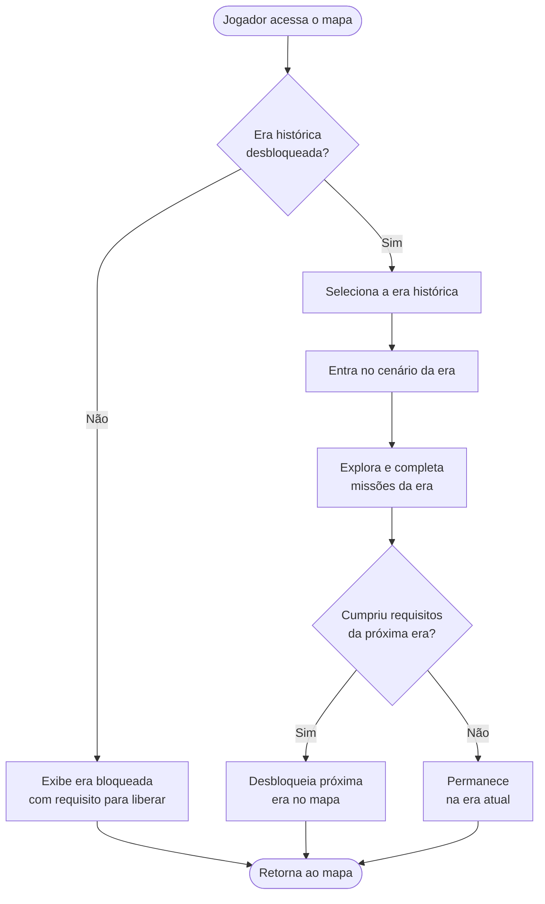
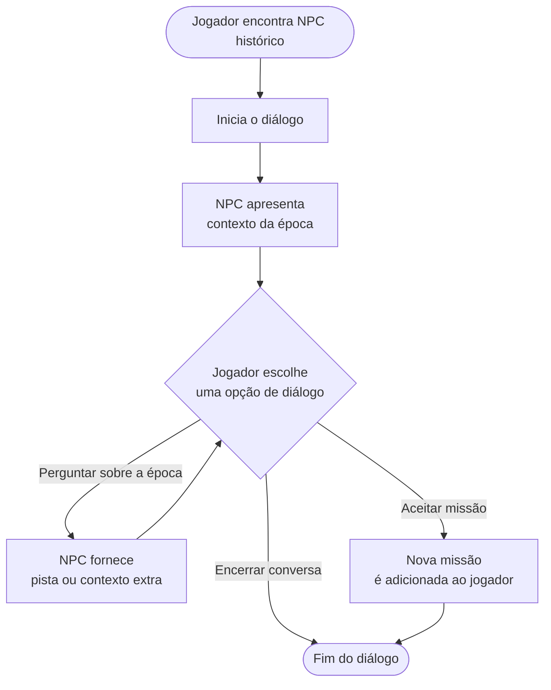
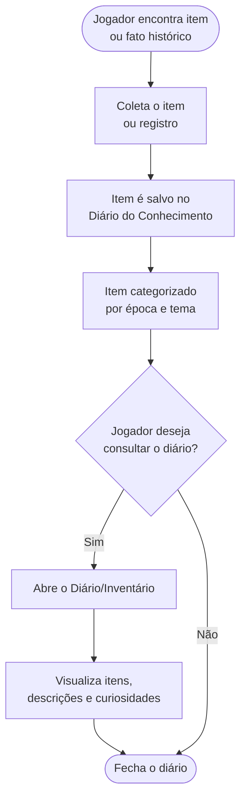
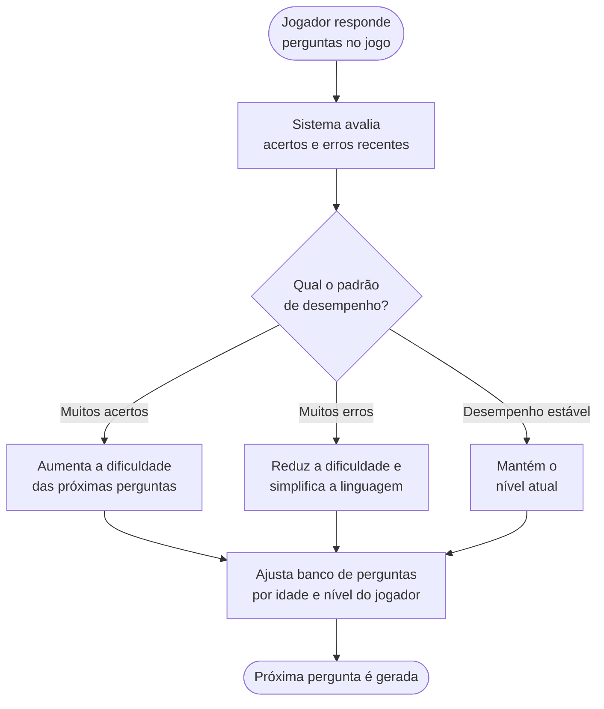
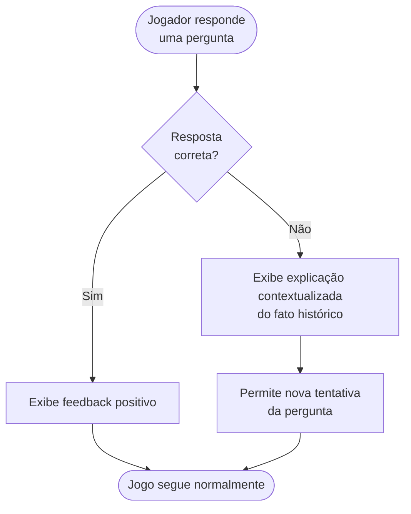
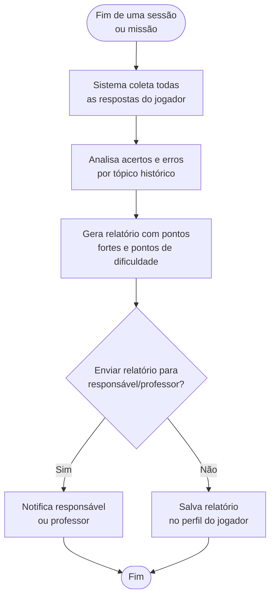
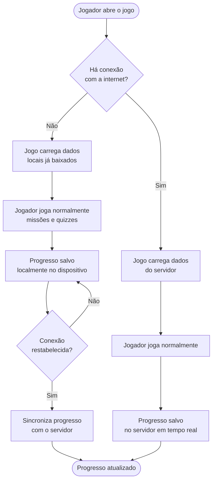

# Fluxogramas dos Requisitos — AprendeRPG

> Um fluxograma para cada Requisito Funcional (RF), detalhando o comportamento esperado do sistema. Local sugerido no repositório: `/docs/fluxogramas_requisitos.md`

---

## RF01 — Mecânica de Quiz em Batalhas

---

## RF02 — Sistema de Linha do Tempo Visual

---

## RF03 — Diálogos com Figuras Históricas

---

## RF04 — Diário/Inventário do Conhecimento

---

## RF05 — Níveis de Dificuldade Adaptativos

---

## RF06 — Feedback Educativo Imediato

---

## RF07 — Relatório de Desempenho

---

## RNF05 — Funcionamento Offline (complemento)

Fluxo de apoio ao requisito não funcional de funcionamento offline, mostrando como o progresso é tratado sem conexão.

